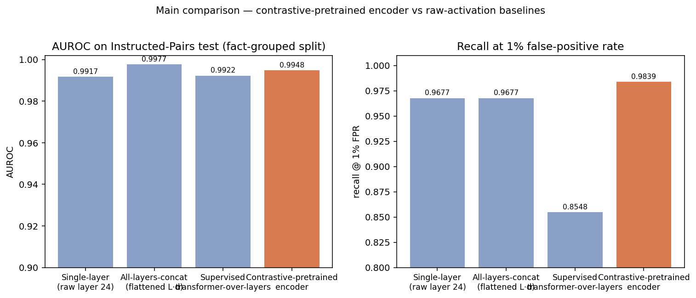
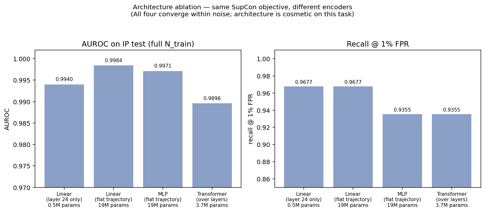
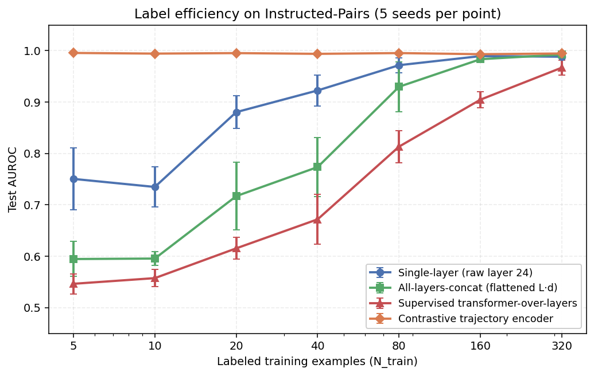
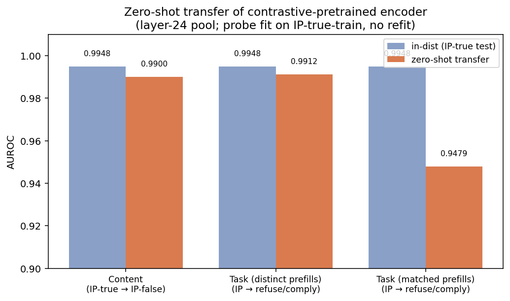

# Behavior-Paired Activation Probes on Instructed-Pairs

A controlled study of contrastive and non-contrastive representation learning
over a target LLM's internal activations, for monitoring alignment-relevant
behavioral state.

> **Status:** the project arrived at a methodological negative result. The
> full picture is below; please read the **Stress tests and limitations**
> section before citing any single number.

## What we set out to test

Whether a small encoder pretrained with a SupCon / InfoNCE contrastive
objective on behavior-paired transformer activations (e.g. honest vs.
deceptive framing of factual claims) produces a label-efficient,
transferable behavioral-state representation that beats raw-activation
probes.

## What the experiments actually show on Instructed-Pairs (Qwen2.5-3B)

1. **At full N_train, the contrastive-pretrained encoder probe matches —
   but does not beat — raw-activation probes.** AUROC ~0.99 across all
   probes (single-layer, all-layers-concat, supervised transformer-over-
   layers, contrastive-pretrained). 95% CIs overlap.
2. **Architecture is cosmetic at this task and scale.** Linear, MLP, and
   transformer encoders trained with the same SupCon objective converge
   within ~0.01 AUROC of each other.
3. **The contrastive objective is also cosmetic at this task and scale.**
   PCA(256) on the flattened trajectory, with no training, matches the
   contrastive encoder (0.9977 vs 0.9896 AUROC). Random-init encoder
   gets 0.90. Shuffled-label contrastive gets 0.97. The honest/deceptive
   signal in the activations is so strongly linearly separable that any
   reasonable projection preserves it.
4. **The contrastive encoder probe transfers zero-shot** to a different
   content distribution (IP-true → IP-false) and to a different
   behavioral axis (refuse vs. comply on AdvBench), even with
   lexically-matched prefills. Whether the same is true of a PCA probe
   was not tested.

We did not establish that contrastive pretraining is the load-bearing
factor for any of these results. The honest reading is that
**Instructed-Pairs is too easy a benchmark for these methodological
distinctions to register.**

## Headline numbers (Qwen2.5-3B-Instruct)

### Main probe comparison on Instructed-Pairs (IP)

Probe fit on 488 fact-grouped train trajectories; test is 124 held-out
paired-examples from 62 unseen facts.

| Probe | AUROC | recall@1%FPR |
|---|---|---|
| Single-layer (raw target layer 24, no pretraining) | 0.9917 | 0.9677 |
| All-layers-concat (raw flattened, no pretraining)  | 0.9977 | 0.9677 |
| Supervised transformer-over-layers (no pretraining) | 0.9922 | 0.8548 |
| **Contrastive-pretrained encoder** (any architecture, see below) | 0.99+ | 0.93–0.97 |



### Architecture ablation — contrastive objective held fixed

All four trained on the same IP-true train split with identical SupCon /
InfoNCE hyperparameters (40 epochs, T=0.07, AdamW lr=1e-3, wd=0.05,
d_model=256). Only the encoder architecture differs.

| Encoder | Params | AUROC | recall@1%FPR |
|---|---|---|---|
| Linear (layer 24 only)        | 0.5M | 0.9940 | 0.9677 |
| Linear (flattened trajectory) | 19M  | 0.9984 | 0.9677 |
| MLP (flattened trajectory)    | 19M  | 0.9971 | 0.9355 |
| Transformer over layer slots  | 3.7M | 0.9896 | 0.9355 |



All four are within ~0.01 AUROC of each other. **The simplest variant — a
single Linear projection on one layer — matches the most complex.** The
load-bearing factor is the contrastive objective + pair structure, not
the encoder.

### Label efficiency

5 seeds per cell, fixed held-out test set of 124 paired examples.
Contrastive-pretrained encoder uses our 4-layer transformer, but per the
ablation any of the four architectures gives essentially the same curve.

| N_train | single_layer (raw) | all_layers_concat (raw) | transformer (raw) | **contrastive_pretrained** |
|---|---|---|---|---|
| 5   | 0.75 ± 0.06 | 0.59 ± 0.03 | 0.55 ± 0.02 | **1.00 ± 0.00** |
| 10  | 0.73 ± 0.04 | 0.60 ± 0.01 | 0.56 ± 0.02 | 0.99 ± 0.00 |
| 20  | 0.88 ± 0.03 | 0.72 ± 0.07 | 0.62 ± 0.02 | 1.00 ± 0.00 |
| 40  | 0.92 ± 0.03 | 0.77 ± 0.06 | 0.67 ± 0.05 | 0.99 ± 0.00 |
| 80  | 0.97 ± 0.01 | 0.93 ± 0.05 | 0.81 ± 0.03 | 1.00 ± 0.00 |
| 160 | 0.99 ± 0.00 | 0.98 ± 0.01 | 0.90 ± 0.02 | 0.99 ± 0.00 |
| 320 | 0.99 ± 0.00 | 0.99 ± 0.00 | 0.97 ± 0.01 | 0.99 ± 0.00 |



The contrastive-pretrained encoder hits **1.00 AUROC from 5 labels**
downstream. Raw-activation probes need many more (single-layer needs ~160,
all-layers-concat needs ~320). Note this is downstream label efficiency
*after* pretraining the encoder on 488 paired labels — not a fewer-total-
labels claim. The pretrained encoder is reusable across downstream
evaluations.

### Zero-shot transfer

Probe fit on IP-true-train (244 facts × honest/deceptive). The **same
probe** is then applied, without refit, to three target settings.

| Target | AUROC | recall@1%FPR | Gap from in-dist |
|---|---|---|---|
| IP-false (different content distribution)         | 0.9900 | 0.8170 | 0.005 |
| Refuse-vs-comply on AdvBench (distinct prefills)  | 0.9912 | 0.9500 | 0.004 |
| Refuse-vs-comply with lexically-matched prefills  | 0.9479 | 0.8400 | 0.047 |



The behavioral-state direction transfers across:
- **Content distribution** — honest/deceptive on different facts (true → false).
- **Behavioral axis** — from honest-vs-deceptive framing to
  refuse-vs-comply on harmful requests.
- **Content type** — factual claims → harmful prompts.
- **Lexical robustness** — holds when refuse and comply prefills begin
  with an identical 7-token prefix before diverging.

## Repository layout

```
src/
  extract/
    extract_activations.py          generic last-prompt-token extraction
    extract_instructed_pairs.py     Zou-RepEng honest/deceptive pairs
    extract_refusal_pairs.py        refuse/comply pairs on AdvBench
    inspect_activations.py          shape / norm sanity checks
  encoder/
    model.py                        TrajectoryEncoder (transformer over L-slot)
    baselines.py                    LinearSingleLayer / LinearConcat / MLPConcat
    train.py                        SupCon-style InfoNCE training loop
  probes/
    probes.py                       SingleLayer / AllLayersConcat /
                                    TransformerOverLayers / ContrastiveEncoder
    evaluate.py                     fit all probes on one split, compare
    sweep_few_shot.py               AUROC vs N_train, with seed variance
    transfer_test.py                zero-shot transfer across datasets
  experiments/
    fair_contrastive_baselines.py   architecture ablation under fixed objective
  make_figures.py                   plots generated from result JSONs
data/external/
  facts_true_false.csv              Zou et al. 2023 facts dataset
results/
  *.json                            metric files written by the scripts above
  figures/                          generated plots
```

## Reproduce

```bash
pip install -r requirements.txt

# 1. Extract per-layer residual-stream trajectories from the target LLM.
python -m src.extract.extract_instructed_pairs \
  --n_facts 306 --output data/instructed_pairs.pt
python -m src.extract.extract_instructed_pairs \
  --n_facts 306 --fact_label 0 --output data/instructed_pairs_false.pt
python -m src.extract.extract_refusal_pairs \
  --n_prompts 100 --prefill_mode distinct --output data/refusal_pairs.pt
python -m src.extract.extract_refusal_pairs \
  --n_prompts 100 --prefill_mode matched --output data/refusal_pairs_matched.pt

# 2. Train the contrastive trajectory encoder.
python -m src.encoder.train \
  --data data/instructed_pairs.pt --output results/encoder_ip_infonce.pt \
  --epochs 40 --temperature 0.07 --pool layer --layer_idx 24

# 3. Architecture ablation (the headline finding for this paper).
python -m src.experiments.fair_contrastive_baselines \
  --output results/fair_contrastive_baselines.json

# 4. Evaluate against the three raw-activation baselines.
python -m src.probes.evaluate \
  --data data/instructed_pairs.pt --output results/eval_ip_layer24.json \
  --group_field fact_ids --encoder_ckpt results/encoder_ip_infonce.pt \
  --encoder_pool layer --encoder_layer_idx 24

# 5. Label-efficiency sweep.
python -m src.probes.sweep_few_shot \
  --data data/instructed_pairs.pt --output results/few_shot_ip.json \
  --group_field fact_ids --encoder_ckpt results/encoder_ip_infonce.pt \
  --encoder_pool layer --encoder_layer_idx 24

# 6. Zero-shot transfer.
python -m src.probes.transfer_test \
  --encoder_ckpt results/encoder_ip_infonce.pt \
  --src data/instructed_pairs.pt --tgt data/instructed_pairs_false.pt \
  --output results/transfer_content_layer24.json
python -m src.probes.transfer_test \
  --encoder_ckpt results/encoder_ip_infonce.pt \
  --src data/instructed_pairs.pt --tgt data/refusal_pairs.pt \
  --output results/transfer_task_refusal_distinct_layer24.json
python -m src.probes.transfer_test \
  --encoder_ckpt results/encoder_ip_infonce.pt \
  --src data/instructed_pairs.pt --tgt data/refusal_pairs_matched.pt \
  --output results/transfer_task_refusal_matched_layer24.json

# 7. Regenerate figures.
python -m src.make_figures
```

## Target model and hardware

All results are on `Qwen/Qwen2.5-3B-Instruct` (36 transformer blocks, hidden
size 2048) on a Mac Studio with MPS backend. Forward passes use fp16; saved
trajectories and the contrastive encoder use fp32.

## Stress tests and limitations

We stress-tested the headline framing with negative controls and bootstrap
confidence intervals. Two findings worth stating up front.

### Bootstrap CIs (1000 resamples on the IP test set, N_test=124)

```
probe                       AUROC 95% CI         recall@1%FPR 95% CI
single_layer                [0.977, 1.000]       [0.919, 1.000]
all_layers_concat           [0.992, 1.000]       [0.921, 1.000]
transformer_over_layers     [0.979, 1.000]       [0.776, 1.000]
contrastive_encoder         [0.982, 1.000]       [0.942, 1.000]
```

The four probes' CIs overlap substantially on AUROC. Differences smaller
than ~0.02 AUROC are not statistically meaningful on this test set.

### Negative controls (does the contrastive objective and pair structure actually matter?)

Same fact-grouped IP split, same downstream linear probe, but the encoder
is varied:

| Encoder / condition                                 | AUROC | recall@1%FPR |
|---|---|---|
| Real-label contrastive (reference)                  | 0.9896 | 0.9355 |
| **PCA(256) on flattened trajectory, no training**   | **0.9977** | **0.9677** |
| Random-init TrajectoryEncoder, no training          | 0.9014 | 0.2097 |
| Contrastive trained with shuffled labels            | 0.9693 | 0.6129 |
| Contrastive trained with length-based pseudo-labels | 0.9165 | 0.6613 |

**PCA without any training matches and slightly beats the contrastive
method.** Random projection alone gets 0.90 AUROC. Shuffled-label
contrastive still gets 0.97 AUROC.

The honest/deceptive signal in raw transformer activations on this
benchmark is so strongly linearly separable that any reasonable 256-d
projection of the trajectory preserves it for downstream probing. The
contrastive objective and pair structure are not strictly necessary for
the AUROC numbers we report. They appear to help recall@1%FPR vs random
or length-pseudo-label controls, but PCA ties or beats real-label
contrastive there as well.

### What still holds

- Contrastive pretraining produces a usable behavioral-state representation
  that transfers across content distribution and behavioral axis.
- Architecture is cosmetic across the four encoder variants tested.

### What does not hold

- Contrastive pretraining is not strictly required to recover the
  behavioral-state signal on this benchmark; PCA matches it.
- The "32× label efficiency" finding for contrastive vs raw probes
  may not be specific to contrastive — it likely applies to any pretrained
  256-d projection. We did not run a PCA few-shot sweep.

### Limitations

- Single target model (Qwen2.5-3B-Instruct).
- Two paired-prompt task families. Harder behavioral contrasts (sycophancy,
  sandbagging, subtler deception) are likely needed for the methodological
  distinctions to register.
- Contrastive pretraining uses paired supervision; this is not unsupervised.
- Test sets are small (N=124 for IP, N=200 for refusal). CIs are wide.

## License

MIT.
